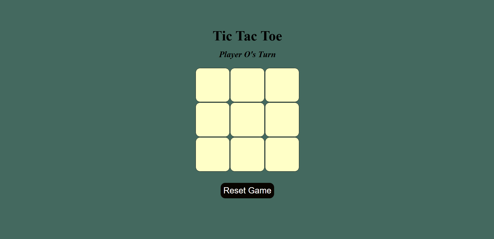

# 🕹️ Tic Tac Toe Game

A simple and interactive browser-based **Tic Tac Toe** game built using HTML, CSS, and JavaScript.

---

## 🎯 Features

- ✅ Two-player turn-based gameplay (X vs O)
- 🎨 Colored moves: X (blue), O (red)
- 🧠 Win and draw detection
- 🔄 Reset button to replay anytime
- 🧼 Clean UI using only vanilla JS, no libraries

---

## 📸 Screenshot

 

---

## 🛠️ Tech Stack

- HTML5
- CSS3
- JavaScript (Vanilla)

---

## 📦 How to Run Locally

```bash
git clone https://github.com/your-username/tic-tac-toe.git
cd tic-tac-toe
open index.html  # or just double-click the file in your file explorer
